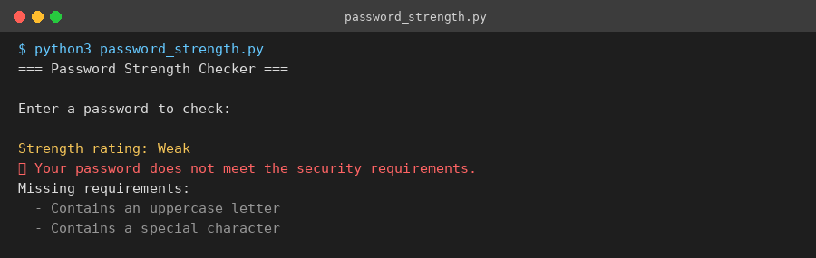
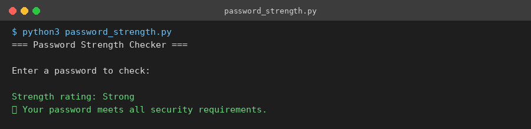
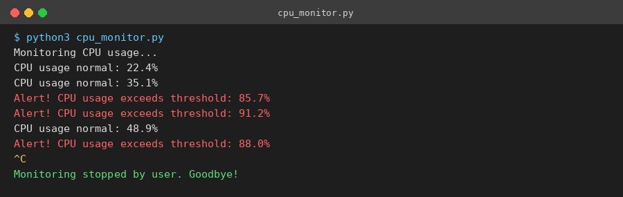
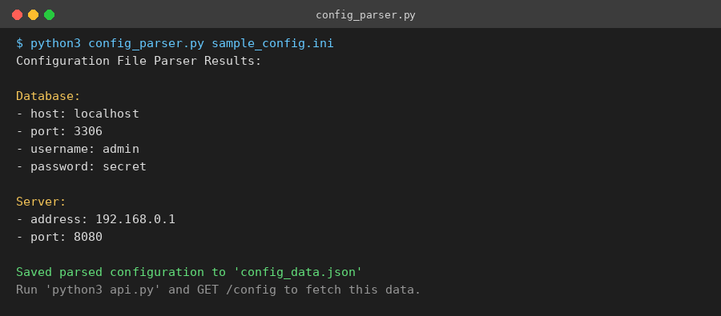
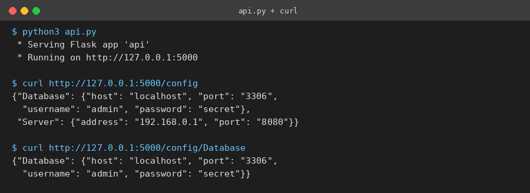
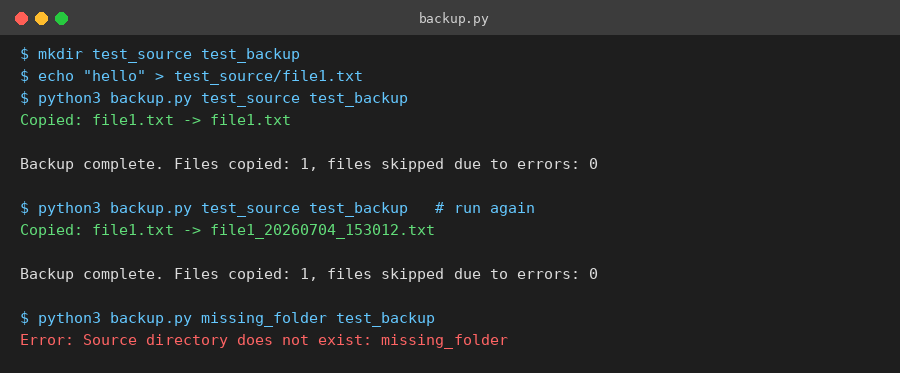

# DevOps Assignment — Full Solutions (Q1–Q4)

This repository contains Python solutions to all four DevOps assignment
questions: a password strength checker, a CPU health monitor, a
configuration file parser with a JSON "database" and REST API, and a
directory backup utility.

Every script includes error handling and is runnable from the command
line. Sample screenshots of real runs are included for each question.

---

## 📋 Prerequisites

You need Python 3 and two third-party packages installed.

**Check Python is installed:**
```bash
python3 --version
```

**Install dependencies:**
```bash
pip3 install flask psutil
```
If `pip3` isn't found, try:
```bash
python3 -m pip install flask psutil
```

> On macOS, always use `python3` and `pip3` (not `python`/`pip`) unless
> you've explicitly aliased them — Macs don't ship a bare `python` command
> by default.

---

## Q1 — Password Strength Checker (`password_strength.py`)

### What it does
Checks a password against 5 security criteria and reports which ones it
passes or fails:
1. At least 8 characters long
2. Contains an uppercase letter
3. Contains a lowercase letter
4. Contains a digit
5. Contains a special character (`!@#$%^&*` etc.)

### How it works
- `check_password_strength(password)` — the core function requested by
  the assignment. Returns `True` only if **all 5** criteria pass.
- `get_failed_criteria(password)` — returns a list of which specific
  rules failed, so the user gets actionable feedback instead of a blunt
  yes/no.
- `describe_strength(password)` — gives a friendlier rating
  (Strong / Moderate / Weak / Very Weak) based on how many rules passed.
- The script uses `getpass.getpass()` to hide your password as you type
  it, which is good security practice.

### How to run
```bash
python3 password_strength.py
```
You'll be prompted to type a password. Try a weak one first, then a
strong one, to see both outcomes.

### Example output — weak password


### Example output — strong password


---

## Q2 — CPU Health Monitor (`cpu_monitor.py`)

### What it does
Continuously watches your machine's CPU usage using the `psutil`
library and prints an alert every time usage goes above a threshold
(default: 80%). It runs forever until you stop it with `Ctrl+C`.

### How it works
- `psutil.cpu_percent(interval=...)` measures CPU usage over a rolling
  time window (this doubles as our polling delay, so we don't need a
  separate `time.sleep()`).
- The main loop runs inside a `while True:`, satisfying the
  "run indefinitely" requirement.
- Error handling covers three cases:
  - `KeyboardInterrupt` (Ctrl+C) → caught in `main()` for a clean exit
    message instead of an ugly traceback.
  - `psutil.Error` → logged as a warning, then monitoring continues.
  - Any other unexpected `Exception` → logged, then monitoring
    continues rather than crashing.
- Command-line flags let you customize behavior without editing code:
  - `--threshold 75` → change the alert threshold
  - `--interval 2` → change how often it checks (in seconds)

### How to run
```bash
python3 cpu_monitor.py
```
To force alerts quickly for a demo (since idle CPUs rarely hit 80%):
```bash
python3 cpu_monitor.py --threshold 5
```
Press `Ctrl+C` to stop.

### Example output


---

## Q3 — Config Parser + JSON "Database" + GET API

This question is split across three files that work together.

### `sample_config.ini`
The sample INI-style config file provided in the assignment, with a
`[Database]` section and a `[Server]` section.

### `config_parser.py` — what it does
- Reads the `.ini` file using Python's built-in `configparser`.
- Extracts every section into a nested dictionary:
  `{"Database": {"host": "localhost", ...}, "Server": {...}}`.
- Prints the results in the exact human-readable format the assignment
  specifies.
- Saves that dictionary as `config_data.json` — this acts as our
  lightweight "database" for the exercise.
- Handles two error cases gracefully instead of crashing:
  - File not found → prints a clear error message.
  - Malformed/corrupt config file → catches `configparser.Error` and
    reports it.

**Run it:**
```bash
python3 config_parser.py sample_config.ini
```

### Example output


### `api.py` — what it does
A minimal Flask web server that reads `config_data.json` and exposes it
over HTTP as the assignment's "GET request to fetch this information":
- `GET /config` → returns the entire parsed configuration as JSON.
- `GET /config/<section>` → returns just one section
  (e.g. `/config/Database`).
- Returns a `404` with a helpful error message if the JSON file is
  missing or the requested section doesn't exist.

**Run it (after running config_parser.py at least once):**
```bash
python3 api.py
```
Then, in a **second terminal window**, fetch the data:
```bash
curl http://127.0.0.1:5000/config
curl http://127.0.0.1:5000/config/Database
```

### Example output


---

## Q4 — Directory Backup Utility (`backup.py`)

### What it does
Copies every file from a source directory into a destination directory.
If a file with the same name already exists at the destination, it
appends a timestamp to the new copy's filename instead of overwriting
the existing one — so nothing is ever silently lost.

### How it works
- Takes source and destination directories as **command-line
  arguments** (`sys.argv`), as required.
- `make_unique_destination_path()` checks if a filename already exists
  at the destination; if so, it appends `_YYYYMMDD_HHMMSS` (and a
  numeric suffix in the rare case of a same-second collision).
- `shutil.copy2()` is used instead of a plain copy so file metadata
  (like modification time) is preserved.
- Error handling:
  - Missing source directory → raises a clear `NotADirectoryError`
    with a helpful message.
  - Missing destination directory → same treatment.
  - Any per-file copy failure (e.g. permissions) is caught individually
    so one bad file doesn't stop the whole backup — it's logged as a
    warning and the script moves on to the next file.

### How to run
```bash
mkdir test_source test_backup
echo "hello" > test_source/file1.txt
python3 backup.py test_source test_backup
```
Run the same command again to see the timestamp-collision logic kick in:
```bash
python3 backup.py test_source test_backup
ls test_backup
```

### Example output


---

## 📁 Repository Structure
```
devops_assignment/
├── README.md               ← this file
├── password_strength.py    ← Q1
├── cpu_monitor.py          ← Q2
├── config_parser.py        ← Q3 (parser)
├── api.py                  ← Q3 (Flask API)
├── sample_config.ini       ← Q3 (sample input)
├── config_data.json        ← Q3 (generated output / "database")
├── backup.py                ← Q4
└── screenshots/             ← example run screenshots used above
```

## 🚀 Quick Start Summary
```bash
pip3 install flask psutil

python3 password_strength.py
python3 cpu_monitor.py --threshold 5      # Ctrl+C to stop
python3 config_parser.py sample_config.ini
python3 api.py                             # then curl in another terminal
python3 backup.py test_source test_backup
```
